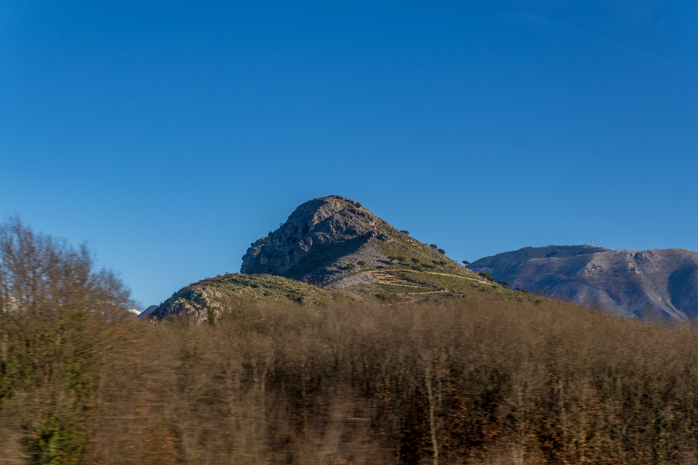
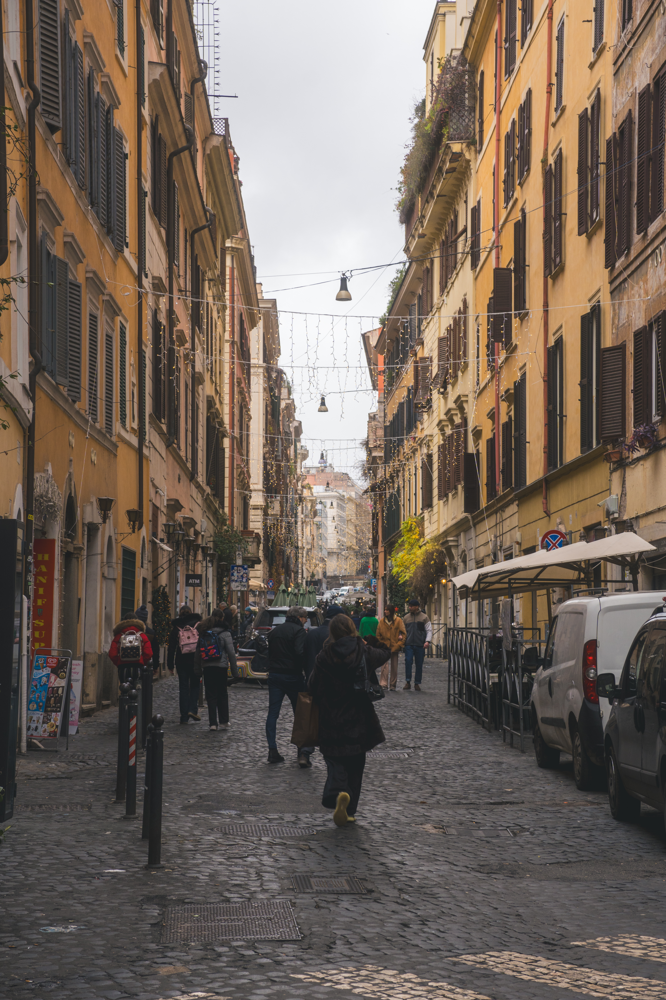
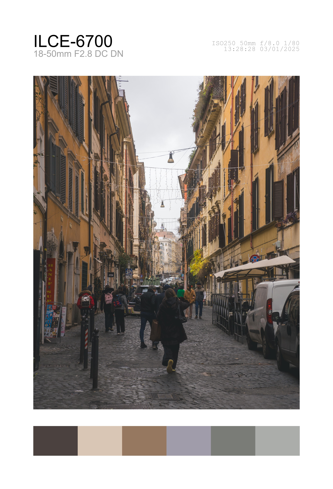

# PalettePro

PalettePro is a Python script that processes images by adding camera details and a color palette to the bottom of the images. It supports both portrait and landscape images and ensures that portrait images fit Instagram's 4:5 aspect ratio with a blurred background.

## Features

- Extracts and displays EXIF data (camera model, focal length, aperture, ISO, exposure time, date, and time).
- Adds a color palette extracted from the image.
- Supports both portrait and landscape images.
- Resizes portrait images to fit Instagram's 4:5 aspect ratio with a blurred background.
- Processes images in parallel using multiprocessing.

## Requirements

- Python 3.x
- Pillow
- colorthief

## Installation

1. Clone the repository:
    ```sh
    git clone https://github.com/yourusername/PalettePro.git
    cd PalettePro
    ```

2. Install the required dependencies:
    ```sh
    pip install -r requirements.txt
    ```

## Usage

1. Place your images in a directory.

2. Run the script with the directory path as an argument:
    ```sh
    python main.py path/to/your/images
    ```

    Replace [path/to/your/images](http://_vscodecontentref_/0) with the actual path to the directory containing your JPEG and PNG images.

3. The processed images will be saved in a subdirectory named `Palletised` within the input directory, organized into `landscape` and `portrait` subfolders.

## Example

### Before

#### Landscape


#### Portrait


### After

#### Landscape


#### Portrait


## License

This project is licensed under the Creative Commons Attribution-NonCommercial 4.0 International (CC BY-NC 4.0) License - see the [LICENSE](LICENSE) file for details.